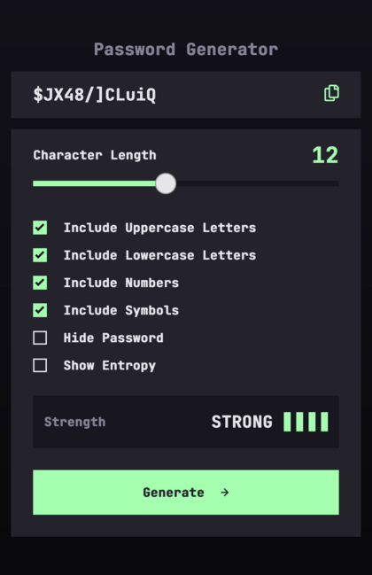
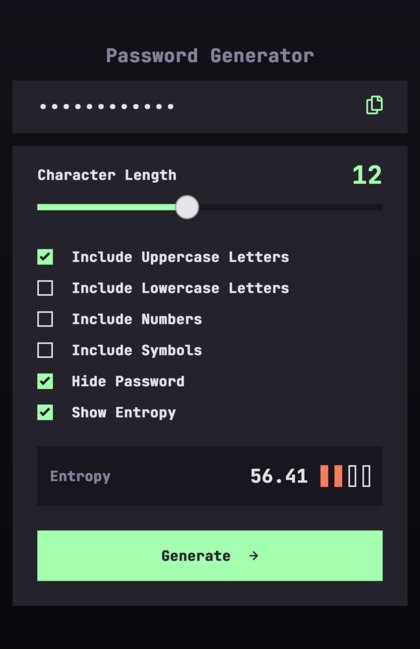

# Password Generator

This is a solution to the [Password generator app challenge on Frontend Mentor](https://www.frontendmentor.io/challenges/password-generator-app-Mr8CLycqjh).

## Table of contents

- [Overview](#overview)
  - [The challenge](#the-challenge)
  - [Screenshot](#screenshot)
  - [Links](#links)
- [My process](#my-process)
  - [Built with](#built-with)
  - [What I learned](#what-i-learned)
  - [Continued development](#continued-development)
  - [Useful resources](#useful-resources)
- [Author](#author)

## Overview

This application allows a user to generate a random password up to 28 characters long. Users may choose to use letters, uppercase and/or lowercase, numbers, and symbols. The strength of each generated password is determined by calculating the bits of entropy.

### The challenge

Users should be able to:

- Generate a password based on the selected inclusion options
- Copy the generated password to the computer's clipboard
- See a strength rating for their generated password
- View the optimal layout for the interface depending on their device's screen size
- See hover and focus states for all interactive elements on the page

### Additional Features

- Hide or show the password on the screen
- Toggle between displaying the standard strength rating or the bits of entropy for the given password

### Screenshot

 

### Links

- [See the code](https://github.com/mattbrannon/coding-challenges/tree/main/password-generator)
- [Try the app](https://mattbrannon-password-generator.vercel.app/)

## My process

This app came with a figma design that was super helpful. One of the first things I do is look at the colors and typography used in the design and create some easy to remember css variables. With those in place, I start going through the design layer by layer and mocking out a basic skeleton of the app. The goal at this point is to simply get the structure of the app laid out with semantically meaningful html elements. Once I feel happy with the overall structure, I begin working on the individual components.

When building out components, I usually create a dedicated `components` folder with sub folders for each component. I've found that doing it this way allows me to separate various parts of a component into another file if needed while still having everything grouped together in one shared folder.

As each component is built and added to the application, I try to spot any bugs in that component and fix them before moving on. After all the pieces have come together and everything seems to work as it should, I start trying to break it. I check for accessibility issues by tabbing through the page with a screen reader. Click everything, drag everything, resize the viewport, zoom out, zoom in, etc. Anything I can do that another person might do. Once I feel it's not easily broken, I run it through `lighthouse` on chrome and fix anything reported back to me.

### Built with

- [Next.js](https://nextjs.org/)
- [Styled Components](https://styled-components.com/)

### What I learned

I spent a good amount of time researching cryptography and hashing.

- What makes a good password?
- What makes a bad password?
- Which is more important complexity or length?
- How is the strength of a password determined?

While I'm by no means an expert one of the main things I learned - it's all about **entropy**.

**What is entropy?**

The short answer is, in the context of crytography, _entropy is the measure of uncertainty of randomness_. A password with a high entropy is said to be more secure than one with low entropy. That is assuming we're talking about random character passwords and not human created ones. When humans create passwords, it becomes a lot more complicated.

Entropy itself is rooted in thermodynamics. I can't pretend to understand most of it. I'll leave a link below so you can read about yourself.

### Useful resources

- [Etropy](https://en.wikipedia.org/wiki/Entropy)
  - [Computing](<https://en.wikipedia.org/wiki/Entropy_(computing)>)
  - [Information Theory](<https://en.wikipedia.org/wiki/Entropy_(information_theory)>)
- [Password Cracking](https://auth0.com/blog/defending-against-password-cracking-understanding-the-math/)
- [Calculating Entropy](https://billatnapier.medium.com/the-wonderful-world-of-hashing-some-biba-entropy-calculations-and-virtually-every-hashing-7aa6ce293109)

## Author

- Website - [Matt Brannon](https://www.mattbrannon.dev) - My personal site
- Frontend Mentor - [@ghostrib](https://www.frontendmentor.io/profile/ghostrib)
- Twitter - [@\_mattbrannon](https://www.twitter.com/_mattbrannon)
